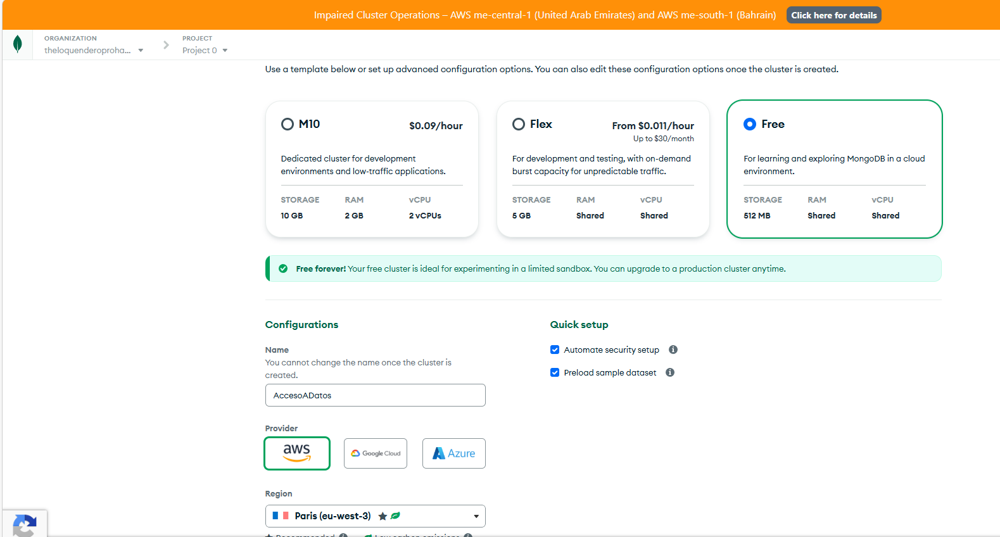
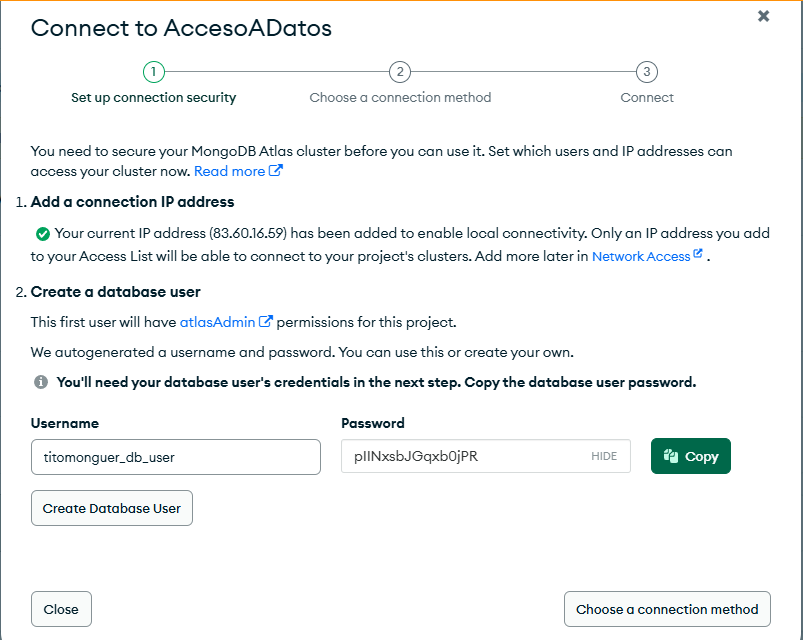
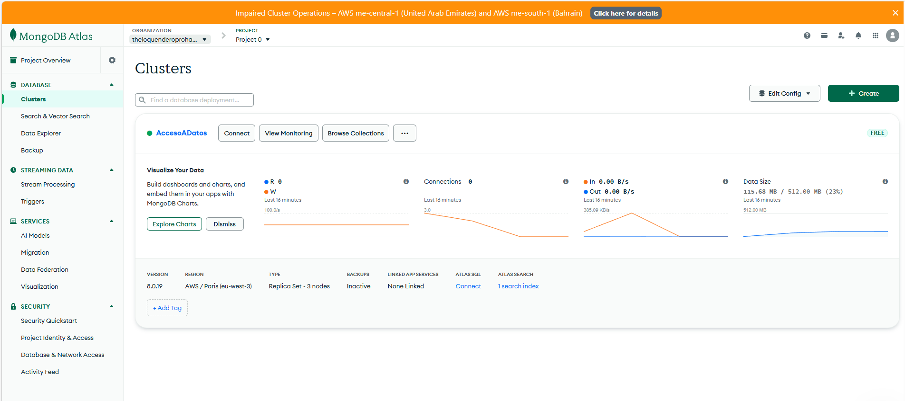
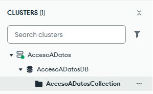

# Tema 9. Practica 9

# Ejercicio:

#### Ejercicio: En esta práctica vamos a aprender a utilizar una base de datos en línea (nube) no relacional y veremos como establecer la conexión con nuestra aplicación desarrollada en Java haciendo uso de SpringBoot. Concretamente utilizaremos una base de datos MongoDB haciendo uso de sus SaaS (Software as a service) MongoDB Atlas. 

## Parte 1: Registro en MongoDB Atlas 

En primer lugar, como vamos a utilizar una base de datos en línea haciendo uso de 
MongoDB Atlas, nos dirigimos al siguiente enlace y nos registramos: 
https://www.mongodb.com/cloud/atlas/register. Deberemos rellenar algunos datos, el 
más importante es el lenguaje que vamos a utilizar (Java) y con qué propósito se va a 
utilizar (microservicios (APIs)). 
#### Se me olvido hacer captura

## Parte 2: Creación de un clúster

Para empezar a trabajar con MongoDB Atlas necesitamos crear un clúster.  
Un clúster es un conjunto de servidores que trabajan conjuntamente como uno para 
proporcionar redundancia, escalabilidad y alta disponibilidad en la nube. 
Para ello en el proceso de registro, en el segundo paso tenemos una pantalla que dice 
“Deploy your cluster”. Elegimos “M0” que es un clúster gratuito que ofrece MongoDB 
Atlas para aprender y explorar bases de datos en la nube de este tipo. 
En el nombre del clúster escribimos AccesoADatos y a continuación podemos elegir 
entre varios proveedores, dejamos AWS y en región podémoste dejar la que encontramos 
por defecto. 



Tras esto debemos pulsar en el botón “Create Deployment” que nos creará nuestro 
clúster para poder alojar una base de datos de tipo MongoDB en la nube. 

## Parte 3: Guardar los datos de usuario administrador 

A continuación aparecerá una pestaña emergente donde nos indica que se ha creado un 
usuario y una contraseña con permisos de administrador en las futuras bases de datos 
que vayamos a crear en nuestro clúster. 
Incluya una captura de pantalla del usuario y la contraseña para evitar perder estos datos 
en un futuro. 



#### User:
titomonguer_db_user
#### Password:
pIINxsbJGqxb0jPR

 Tras esto hacemos click en crear usuario y pasamos al siguiente paso haciendo click en 
“Choose a connection method”. 

## Parte 4. Obtención de datos de conexión a MongoDB Atlas.

En este paso, como nos vamos a conectar a una base de datos en la nube, necesitamos 
obtener una serie de datos para establecer esta conexión desde nuestra aplicación Java. 
Elegimos la opción “Drivers” ya que como hasta ahora, nos vamos a conectar a la base 
de datos haciendo uso de un conector Java.  
Tras esto debemos dejar por defecto los datos del driver de Java y debemos copiar y 
guardarnos el string de conexión. IMPORTANTE NO PERDERLO. Esta cadena de 
texto nos permitirá establecer la conexión con nuestro clúster y base de datos. 

#### Cadena de texto:
```
mongodb+srv://titomonguer_db_user:<db_password>@accesoadatos.o5axkao.mongodb.net/?appName=AccesoADatos
```
#### Ejemplo codigo:
```

import com.mongodb.ConnectionString;
import com.mongodb.MongoClientSettings;
import com.mongodb.MongoException;
import com.mongodb.ServerApi;
import com.mongodb.ServerApiVersion;
import com.mongodb.client.MongoClient;
import com.mongodb.client.MongoClients;
import com.mongodb.client.MongoDatabase;
import org.bson.Document;

public class MongoClientConnectionExample {
    public static void main(String[] args) {
        String connectionString = "mongodb+srv://titomonguer_db_user:<db_password>@accesoadatos.o5axkao.mongodb.net/?appName=AccesoADatos";

        ServerApi serverApi = ServerApi.builder()
                .version(ServerApiVersion.V1)
                .build();

        MongoClientSettings settings = MongoClientSettings.builder()
                .applyConnectionString(new ConnectionString(connectionString))
                .serverApi(serverApi)
                .build();

        // Create a new client and connect to the server
        try (MongoClient mongoClient = MongoClients.create(settings)) {
            try {
                // Send a ping to confirm a successful connection
                MongoDatabase database = mongoClient.getDatabase("admin");
                database.runCommand(new Document("ping", 1));
                System.out.println("Pinged your deployment. You successfully connected to MongoDB!");
            } catch (MongoException e) {
                e.printStackTrace();
            }
        }
    }
}
```


## Parte 5. Creación de una BD y colección en MongoDB Atlas.

Nos dirigimos a la opción “Browse collections” de nuestro clúster, en esta sección 
podemos administrar las bases de datos. Eliminamos la base de datos que incluye por 
defecto y creamos una con el nombre AccesoADatosDB, para ello deberá hacer click en 
“Add my own data”. En el nombre de colección ponemos AccesoADatosCollection, una 
colección es el equivalente a una tabla, por ahora creamos una por defecto para poder 
continuar pero más adelante crearemos otras más realistas para la realización de la 
práctica.


