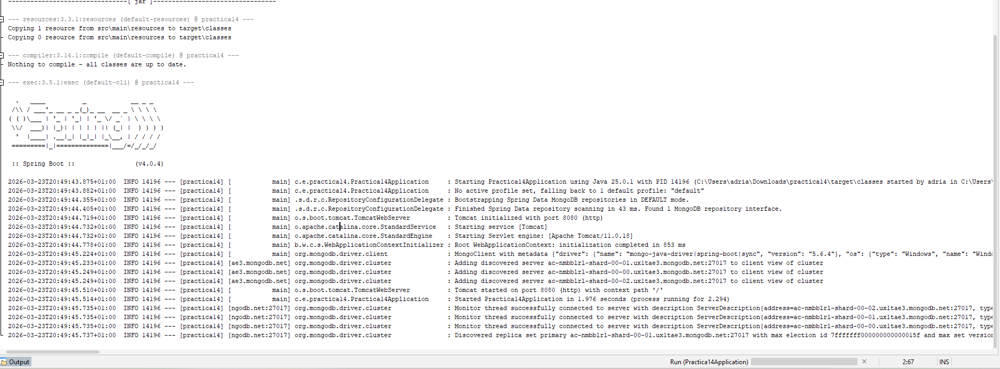
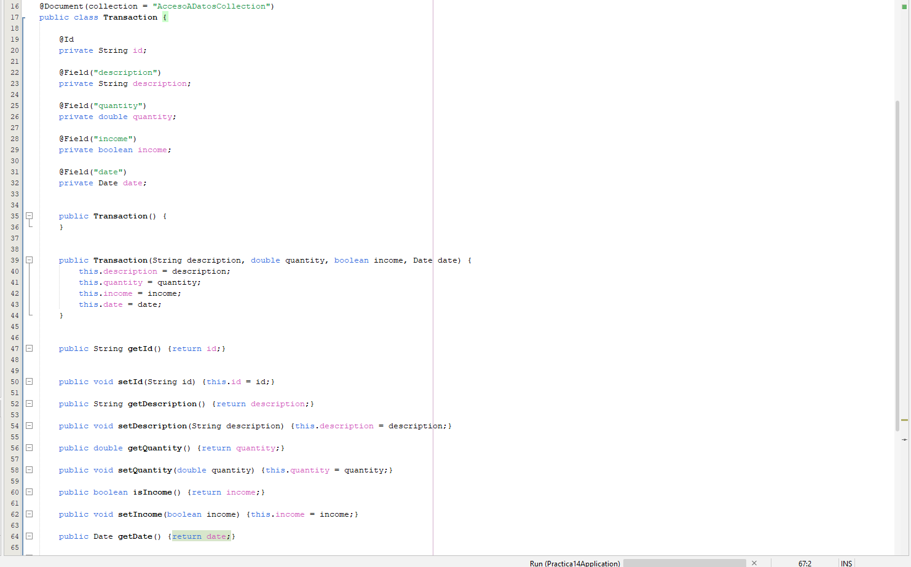
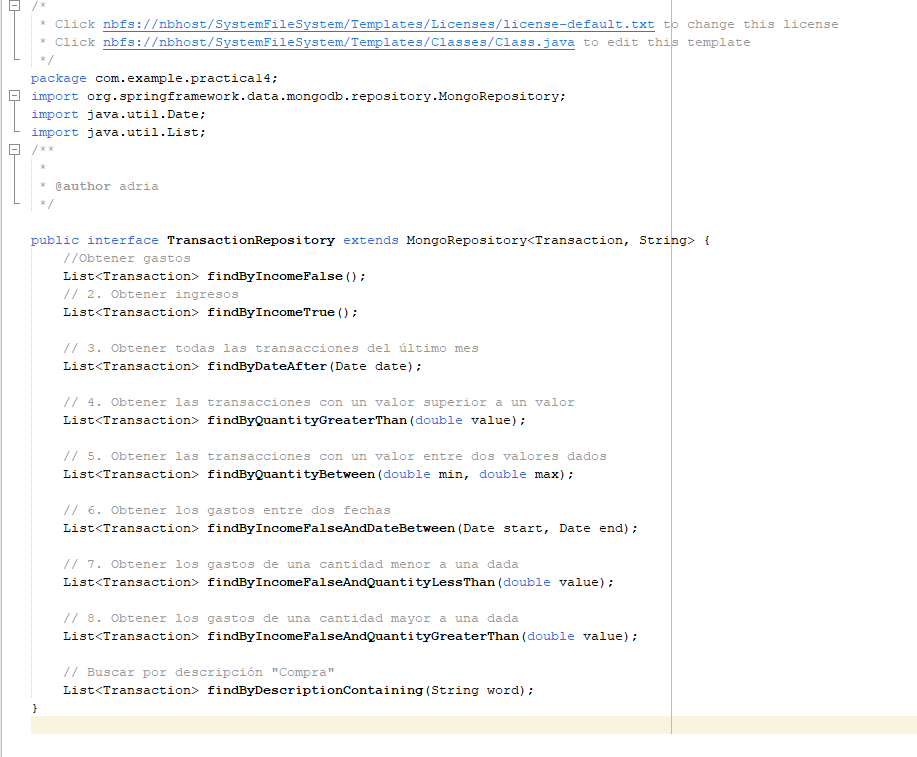
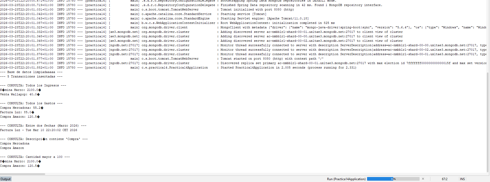
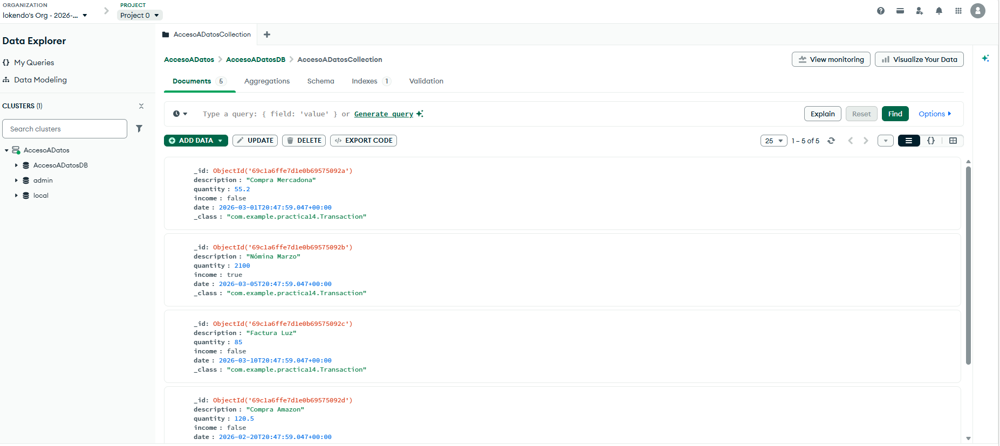

# Tema 9. Practica 9

# Ejercicio:

#### Ejercicio: En esta práctica vamos a aprender a utilizar una base de datos en línea (nube) no relacional y veremos como establecer la conexión con nuestra aplicación desarrollada en Java haciendo uso de SpringBoot. Concretamente utilizaremos una base de datos MongoDB haciendo uso de sus SaaS (Software as a service) MongoDB Atlas. 

## Parte 1: Registro en MongoDB Atlas 

En primer lugar, como vamos a utilizar una base de datos en línea haciendo uso de 
MongoDB Atlas, nos dirigimos al siguiente enlace y nos registramos: 
https://www.mongodb.com/cloud/atlas/register. Deberemos rellenar algunos datos, el 
más importante es el lenguaje que vamos a utilizar (Java) y con qué propósito se va a 
utilizar (microservicios (APIs)). 
#### Se me olvido hacer captura

## Parte 2: Creación de un clúster

Para empezar a trabajar con MongoDB Atlas necesitamos crear un clúster.  
Un clúster es un conjunto de servidores que trabajan conjuntamente como uno para 
proporcionar redundancia, escalabilidad y alta disponibilidad en la nube. 
Para ello en el proceso de registro, en el segundo paso tenemos una pantalla que dice 
“Deploy your cluster”. Elegimos “M0” que es un clúster gratuito que ofrece MongoDB 
Atlas para aprender y explorar bases de datos en la nube de este tipo. 
En el nombre del clúster escribimos AccesoADatos y a continuación podemos elegir 
entre varios proveedores, dejamos AWS y en región podémoste dejar la que encontramos 
por defecto. 


Tras esto debemos pulsar en el botón “Create Deployment” que nos creará nuestro 
clúster para poder alojar una base de datos de tipo MongoDB en la nube. 

## Parte 3: Guardar los datos de usuario administrador 

A continuación aparecerá una pestaña emergente donde nos indica que se ha creado un 
usuario y una contraseña con permisos de administrador en las futuras bases de datos 
que vayamos a crear en nuestro clúster. 
Incluya una captura de pantalla del usuario y la contraseña para evitar perder estos datos 
en un futuro. 


#### User:
titomonguer_db_user
#### Password:
pIINxsbJGqxb0jPR

 Tras esto hacemos click en crear usuario y pasamos al siguiente paso haciendo click en 
“Choose a connection method”. 

## Parte 4. Obtención de datos de conexión a MongoDB Atlas.

En este paso, como nos vamos a conectar a una base de datos en la nube, necesitamos 
obtener una serie de datos para establecer esta conexión desde nuestra aplicación Java. 
Elegimos la opción “Drivers” ya que como hasta ahora, nos vamos a conectar a la base 
de datos haciendo uso de un conector Java.  
Tras esto debemos dejar por defecto los datos del driver de Java y debemos copiar y 
guardarnos el string de conexión. IMPORTANTE NO PERDERLO. Esta cadena de 
texto nos permitirá establecer la conexión con nuestro clúster y base de datos. 

#### Cadena de texto:
```
mongodb+srv://titomonguer_db_user:<db_password>@accesoadatos.o5axkao.mongodb.net/?appName=AccesoADatos
```
#### Ejemplo codigo:
```

import com.mongodb.ConnectionString;
import com.mongodb.MongoClientSettings;
import com.mongodb.MongoException;
import com.mongodb.ServerApi;
import com.mongodb.ServerApiVersion;
import com.mongodb.client.MongoClient;
import com.mongodb.client.MongoClients;
import com.mongodb.client.MongoDatabase;
import org.bson.Document;

public class MongoClientConnectionExample {
    public static void main(String[] args) {
        String connectionString = "mongodb+srv://titomonguer_db_user:<db_password>@accesoadatos.o5axkao.mongodb.net/?appName=AccesoADatos";

        ServerApi serverApi = ServerApi.builder()
                .version(ServerApiVersion.V1)
                .build();

        MongoClientSettings settings = MongoClientSettings.builder()
                .applyConnectionString(new ConnectionString(connectionString))
                .serverApi(serverApi)
                .build();

        // Create a new client and connect to the server
        try (MongoClient mongoClient = MongoClients.create(settings)) {
            try {
                // Send a ping to confirm a successful connection
                MongoDatabase database = mongoClient.getDatabase("admin");
                database.runCommand(new Document("ping", 1));
                System.out.println("Pinged your deployment. You successfully connected to MongoDB!");
            } catch (MongoException e) {
                e.printStackTrace();
            }
        }
    }
}
```


## Parte 5. Creación de una BD y colección en MongoDB Atlas.

Nos dirigimos a la opción “Browse collections” de nuestro clúster, en esta sección 
podemos administrar las bases de datos. Eliminamos la base de datos que incluye por 
defecto y creamos una con el nombre AccesoADatosDB, para ello deberá hacer click en 
“Add my own data”. En el nombre de colección ponemos AccesoADatosCollection, una 
colección es el equivalente a una tabla, por ahora creamos una por defecto para poder 
continuar pero más adelante crearemos otras más realistas para la realización de la 
práctica.


## Parte 6. Creación de un proyecto en SpringBoot

Como siempre, nos dirigimos a https://start.spring.io/ y cambiamos los metadatos del 
proyecto a practica12_13_14 menos el package name que lo dejamos con lo que se 
genere. En la sección de dependencias añadimos “Spring Web” y “Spring Data 
MongoDB”. Y en tipo de proyecto elegimos “Maven”. 


Tras esto, genere el proyecto e inclúyalo en Eclipse. 

## Parte 7. Conectar la aplicación con MongoDB Atlas 

En el archivo “application.properties” añadimos una nueva propiedad 
“spring.data.mongodb.uri=“ y pegamos sin espacios la cadena de conexión que 
obtuvimos en el paso 4. 
Pruebe a iniciar la aplicación. Si falla revise que la cadena de conexión esté actualizada 
siguiendo este formato: 

## Parte 8. Creación de un modelo de datos

Aunque los datos de las bases de datos no relacionales (llamados documentos) son 
f
lexibles y no necesariamente deben adaptarse a un modelo de datos concreto, 
crearemos un modelo de datos para facilitar el uso de dichos datos de forma 
estandarizada en nuestra aplicación.  
Para esta práctica vamos a crear el backend de una aplicación que nos permita llevar el 
control de nuestros gastos e ingresos. Por ello, vamos a crear un documento llamado 
“Transaction” que representará este concepto de gasto o ingreso. 
Debe crear este documento llamado “Transaction” que debe tener como campos. 

*  id: string clave primaria.
*   description: string. (Descripción del ingreso o gasto).
*    quantity: double. (Cantidad gastada).
*    income: boolean (true si es un ingreso, false si es un gasto).
*    date: Date. (Fecha en la que se hizo el gasto u obtuvo el ingreso)
 Debe crear adicionalmente un constructor con parámetros para inicializar dichos campos 
así como todos los getters y setters.

## Parte 9. Creación de un repositorio 
A continuación debemos crear un repositorio (MongoRepository) que es una interfaz que 
proporciona un conjunto de operaciones CRUD (crear, leer, actualizar, eliminar) para 
interactuar con nuestra base de datos de tipo MongoDB. Recuerde que, como hemos 
visto en teoría, esta interfaz proporciona por defecto una serie de métodos que podemos 
utilizar para manipular los datos de la base de datos.  
No obstante vamos a crear algunos métodos personalizados útiles para nuestra 
aplicación (Importante utilizar la convención de nombres vista en teoría). Deberá añadir 
métodos en esta interfaz que permitan: 
* Obtener los gastos. 
* Obtener los ingresos. 
* Obtener todas las transacciones del último mes. 
* Obtener las transacciones con un valor superior a un valor. 
* Obtener las transacciones con un valor entre dos valores dados. 
* Obtener los gastos entre dos fechas. 
* Obtener los gastos de una cantidad menor a una dada. 
* Obtener los gastos de una cantidad mayor a una dada.


## Parte 10. Probando la aplicación.
En la clase main de la aplicación SpringBoot deberá implementar la interfaz 
“CommandLineRunner” que nos permitirá ejecutar código específico justo después de 
que la aplicación Spring Boot haya arrancado. Lo utilizaremos para definir el siguiente 
método:  
@Override  
public void run(String... args) throws Exception {} 
Y dentro de este deberá incluir la siguiente funcionalidad:

* Borrado de todos los datos. 
* Inserta algunos datos de prueba: Crea al menos 5 transacciones con descripción, 
cantidad, tipo (ingreso o gasto) y fecha en las que haya datos de todo tipo para hacer 
las siguientes pruebas y asegurar resultados en las operaciones siguientes. 
* Realiza las siguientes consultas: 
* Obtén todas las transacciones de tipo "Ingreso". 
* Obtén todas las transacciones de tipo "Gasto". 
* Obtén las transacciones que ocurrieron entre dos fechas. 
* Busca transacciones que contengan la palabra "Compra" en su descripción. 
* Filtra las transacciones con una cantidad mayor a 100. 
Debe mostrar por consola los resultados de las consultas de obtención de datos.

```
package com.example.practica14;

import java.util.Calendar;
import org.springframework.beans.factory.annotation.Autowired;
import org.springframework.boot.CommandLineRunner;
import org.springframework.boot.SpringApplication;
import org.springframework.boot.autoconfigure.SpringBootApplication;
import java.util.Calendar;
import java.util.Date;
import java.util.List;


@SpringBootApplication
public class Practica14Application implements CommandLineRunner {

    @Autowired
    private TransactionRepository repository;

    public static void main(String[] args) {
        SpringApplication.run(Practica14Application.class, args);
    }

    @Override
    public void run(String... args) throws Exception {
        repository.deleteAll();
        System.out.println("--- Base de datos limpiadaaaaa ---");

        Calendar cal = Calendar.getInstance();
        
        cal.set(2026, Calendar.MARCH, 1);
        repository.save(new Transaction("Compra Mercadona", 55.20, false, cal.getTime()));
        
        cal.set(2026, Calendar.MARCH, 5);
        repository.save(new Transaction("Nómina Marzo", 2100.00, true, cal.getTime()));
        
        cal.set(2026, Calendar.MARCH, 10);
        repository.save(new Transaction("Factura Luz", 85.00, false, cal.getTime()));
        
        cal.set(2026, Calendar.FEBRUARY, 20); // Fecha mes pasado
        repository.save(new Transaction("Compra Amazon", 120.50, false, cal.getTime()));
        
        cal.set(2026, Calendar.MARCH, 15);
        repository.save(new Transaction("Venta Wallapop", 40.00, true, cal.getTime()));

        System.out.println("--- 5 Transacciones insertadas ---");
        
        System.out.println("\n--- CONSULTA: Todos los Ingresos ---");
        repository.findByIncomeTrue().forEach(t -> System.out.println(t.getDescription() + ": " + t.getQuantity() + "€"));

        System.out.println("\n--- CONSULTA: Todos los Gastos ---");
        repository.findByIncomeFalse().forEach(t -> System.out.println(t.getDescription() + ": " + t.getQuantity() + "€"));

        System.out.println("\n--- CONSULTA: Entre dos fechas (Marzo 2026) ---");
        cal.set(2026, Calendar.MARCH, 1);
        Date inicio = cal.getTime();
        cal.set(2026, Calendar.MARCH, 31);
        Date fin = cal.getTime();
        repository.findByIncomeFalseAndDateBetween(inicio, fin).forEach(t -> System.out.println(t.getDescription() + " - " + t.getDate()));

        System.out.println("\n--- CONSULTA: Descripción contiene 'Compra' ---");
        repository.findByDescriptionContaining("Compra").forEach(t -> System.out.println(t.getDescription()));

        System.out.println("\n--- CONSULTA: Cantidad mayor a 100 ---");
        repository.findByQuantityGreaterThan(100.0).forEach(t -> System.out.println(t.getDescription() + ": " + t.getQuantity() + "€"));
    }
}
```


