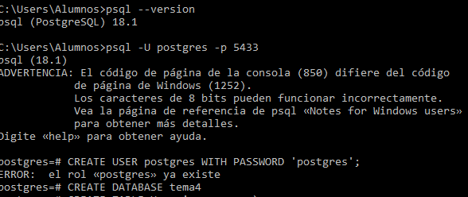
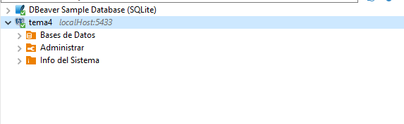
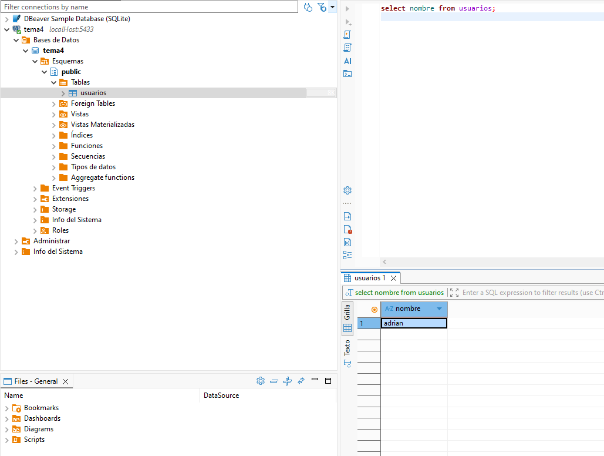
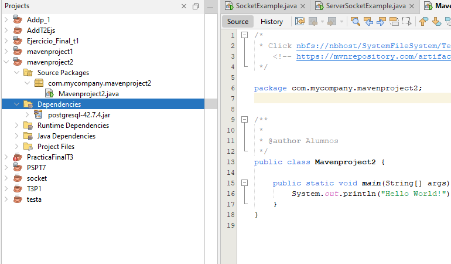
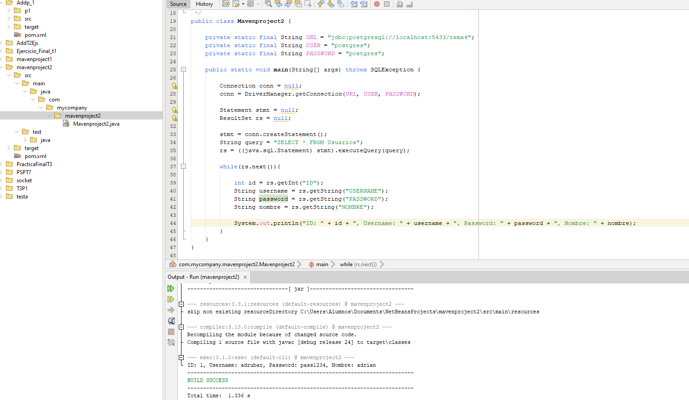

# Tema 4. Parte previa

## Parte previa 1:
Investigue cómo instalar e instale PostgreSQL en su ordenador. Tras haber instalado PostgreSQL 
demuestre que puede acceder a través de la terminal a sus servicios haciendo uso del comando 
“psql postgres” y realice una captura de pantalla.

## Parte previa 2:
Investigue cómo conectarse a la base de datos “tema4” desde DBeaver e incluya una captura 
de pantalla que demuestre la conexión. 

A continuación deberá crear una tabla con la 
siguiente sentencia y añadir un par de datos 
de ejemplo (use sus datos personales como 
ejemplo). Demuestre con una consulta 
SELECT la creación de la tabla y realice una 
captura de pantalla.

## Parte 1.

Deberá crear un proyecto de tipo Maven e incluir la dependencia especificado en el siguiente 
enlace (Driver JDBC PostgreSQL): 
https://mvnrepository.com/artifact/org.postgresql/postgresql/42.7.4 
Realice una captura de pantalla con la dependencia añadida. 

## Parte 2.

El objetivo ahora es establecer una conexión entre un programa escrito en Java y nuestra base de 
datos haciendo uso del conector añadido con la dependencia anterior. 
El programa deberá conectarse a la base de datos e imprimir si la conexión ha sido o no exitosa. 
Realice una captura de pantalla de la salida de su programa e incluya el código utilizado. 

## Parte 3.

Una vez establecida la conexión podemos utilizar el siguiente código para mostrar la información 
de la BDD: 
Explique con sus palabras que hace el código anterior línea a línea: 
Realice una captura de pantalla el resultado obtenido por consola:

