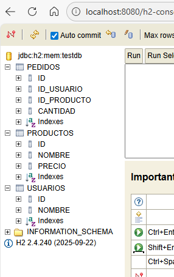

## Incluya en el fichero “data.sql” las consultas de bases de datos para crear las siguientes tablas:

```
REATE TABLE IF NOT EXISTS usuarios (
	id SERIAL PRIMARY KEY,
	nombre VARCHAR(100) NOT NULL		
);


CREATE TABLE IF NOT EXISTS productos(
	id SERIAL PRIMARY KEY,
	nombre VARCHAR(100) NOT NULL,
	precio DECIMAL(10,2) NOT NULL
);

CREATE TABLE IF NOT EXISTS pedidos(
	id SERIAL PRIMARY KEY,
	id_usuario INT NOT NULL,
	id_producto INT,
	cantidad INT NOT NULL,
	FOREIGN KEY (id_usuario) REFERENCES usuarios(id),
	FOREIGN KEY (id_producto) REFERENCES productos(id)
);
```

## Incluya una captura de pantalla del gestor H2 donde se vean las tablas creadas:



## Incluya el código añadido para añadir un usuario:
```
public class AddUsuario extends javax.swing.JPanel {

    private MenuFrame frame;
    /**
     * Creates new form SubMenu1
     */
    public AddUsuario(MenuFrame frame) {
        this.frame = frame;
        initComponents();
    }

    /**
     * This method is called from within the constructor to initialize the form.
     * WARNING: Do NOT modify this code. The content of this method is always
     * regenerated by the Form Editor.
     */
    @SuppressWarnings("unchecked")
    // <editor-fold defaultstate="collapsed" desc="Generated Code">                          
    private void initComponents() {

        jLabel2 = new javax.swing.JLabel();
        jLabel1 = new javax.swing.JLabel();
        jScrollPane1 = new javax.swing.JScrollPane();
        usernameText = new javax.swing.JTextArea();
        addUsuario = new javax.swing.JButton();
        jButton2 = new javax.swing.JButton();

        jLabel2.setText("jLabel2");

        jLabel1.setText("Nombre de usuario");

        usernameText.setColumns(20);
        usernameText.setRows(5);
        jScrollPane1.setViewportView(usernameText);

        addUsuario.setText("Añadir usuario");
        addUsuario.addMouseListener(new java.awt.event.MouseAdapter() {
            public void mouseClicked(java.awt.event.MouseEvent evt) {
                addUsuarioMouseClicked(evt);
            }
        });

        jButton2.setText("Atras");
        jButton2.addMouseListener(new java.awt.event.MouseAdapter() {
            public void mouseClicked(java.awt.event.MouseEvent evt) {
                jButton2MouseClicked(evt);
            }
        });

        javax.swing.GroupLayout layout = new javax.swing.GroupLayout(this);
        this.setLayout(layout);
        layout.setHorizontalGroup(
            layout.createParallelGroup(javax.swing.GroupLayout.Alignment.LEADING)
            .addGroup(layout.createSequentialGroup()
                .addGroup(layout.createParallelGroup(javax.swing.GroupLayout.Alignment.LEADING)
                    .addGroup(layout.createSequentialGroup()
                        .addGap(140, 140, 140)
                        .addComponent(jLabel1))
                    .addGroup(layout.createSequentialGroup()
                        .addGap(24, 24, 24)
                        .addGroup(layout.createParallelGroup(javax.swing.GroupLayout.Alignment.LEADING, false)
                            .addComponent(jScrollPane1)
                            .addComponent(addUsuario, javax.swing.GroupLayout.DEFAULT_SIZE, javax.swing.GroupLayout.DEFAULT_SIZE, Short.MAX_VALUE)
                            .addComponent(jButton2, javax.swing.GroupLayout.DEFAULT_SIZE, 354, Short.MAX_VALUE))))
                .addContainerGap(22, Short.MAX_VALUE))
        );
        layout.setVerticalGroup(
            layout.createParallelGroup(javax.swing.GroupLayout.Alignment.LEADING)
            .addGroup(layout.createSequentialGroup()
                .addGap(70, 70, 70)
                .addComponent(jLabel1)
                .addPreferredGap(javax.swing.LayoutStyle.ComponentPlacement.RELATED)
                .addComponent(jScrollPane1, javax.swing.GroupLayout.PREFERRED_SIZE, 31, javax.swing.GroupLayout.PREFERRED_SIZE)
                .addGap(42, 42, 42)
                .addComponent(addUsuario, javax.swing.GroupLayout.PREFERRED_SIZE, 41, javax.swing.GroupLayout.PREFERRED_SIZE)
                .addGap(18, 18, 18)
                .addComponent(jButton2, javax.swing.GroupLayout.PREFERRED_SIZE, 41, javax.swing.GroupLayout.PREFERRED_SIZE)
                .addContainerGap(35, Short.MAX_VALUE))
        );
    }// </editor-fold>                        

    private void jButton2MouseClicked(java.awt.event.MouseEvent evt) {                                      
        frame.mostrar("menu");
    }                                     

    private void addUsuarioMouseClicked(java.awt.event.MouseEvent evt) {                                        
        String username = usernameText.getText();
        if(!username.equals("")){
            String URL_CONEXION = "jdbc:h2:mem:testdb";
            String usuario = "sa";
            String password = "password";
            try{
                Connection conn = DriverManager.getConnection(URL_CONEXION, usuario, password);
                Statement statementAgregar = conn.createStatement();
                String sentenciaSQLAgregar = "INSERT INTO usuarios (nombre) VALUES (?)";
                PreparedStatement pstmtAgregar = conn.prepareStatement(sentenciaSQLAgregar);
                pstmtAgregar.setString(1, username);
                int filasAfectadas = pstmtAgregar.executeUpdate();
                if(filasAfectadas > 0){
                    System.out.println("Se inserto correctamente");
                }else{
                    System.out.println("No se ha podido insertar");
                }
            }catch(SQLException ex){
                Logger.getLogger(AddUsuario.class.getName()).log(Level.SEVERE, null, ex);
            }
        }
    }                                       


    // Variables declaration - do not modify                     
    private javax.swing.JButton addUsuario;
    private javax.swing.JButton jButton2;
    private javax.swing.JLabel jLabel1;
    private javax.swing.JLabel jLabel2;
    private javax.swing.JScrollPane jScrollPane1;
    private javax.swing.JTextArea usernameText;
    // End of variables declaration                   
}
```
