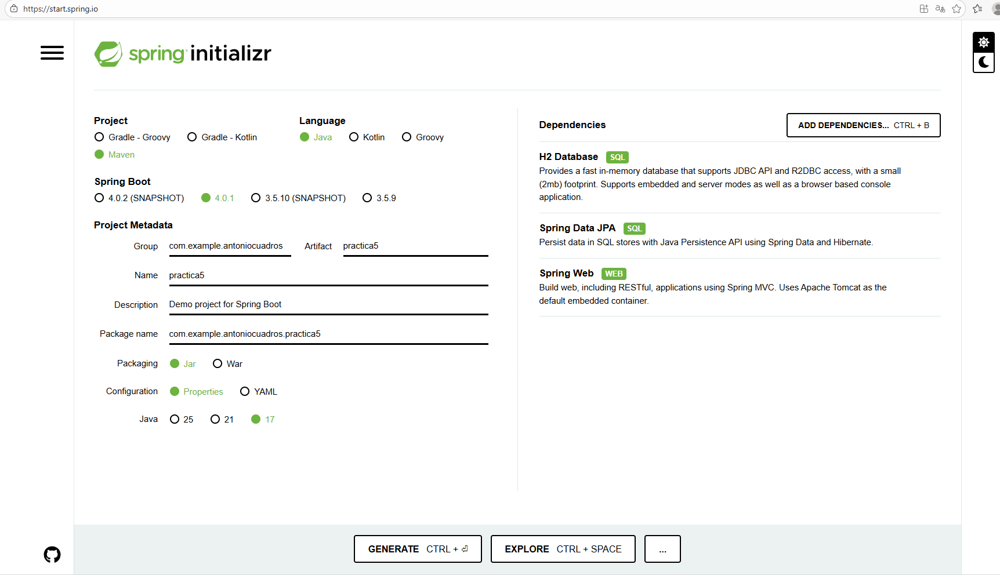

# Practica guiada

## En este ejercicio se propone aprender aspectos básicos del framework Spring Boot con el objetivo final de conectarnos a una base de datos embebida H2. 

# Parte 1

### Descarga de Spring Boot y configuración del proyecto. 
### En primer lugar nos dirigimos a la siguiente página web: https://start.spring.io/. 
### Esta página nos permite configurar: 
### Tipo de proyecto: elegiremos Maven. 
### • Lenguaje: Java. 
### • Versión de Spring Boot: Dejamos la versión por defecto. 
### • Metadatos del proyecto, lo configuramos como en la siguiente imagen (modifique el grupo para incluir su nombre y primer apellido):

### En la parte de la derecha podemos elegir y añadir dependencias a nuestro proyecto de forma muy sencilla, en nuestro caso vamos a añadir nuestra base de datos de tipo H2: "H2 Database"
### Vamos a añadir también el módulo Spring Web para simular el funcionamiento de una aplicación web en este ejercicio: "Spring Data JPA"
### También añadimos esta dependencia: "Spring Web"
### A continuación incluya una captura de pantalla de la web anteriormente mencionada con toda la configuración realizada:

### Finalmente hacemos click en “Generate” y se nos descargará el proyecto con toda la configuración realizada.En nuestro archivo pom.xml podemos ver como se nos ha añadido por ejemplo la dependencia de la base de datos H2.

# Parte 2

