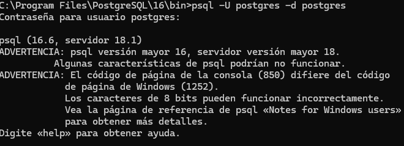
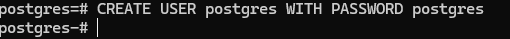
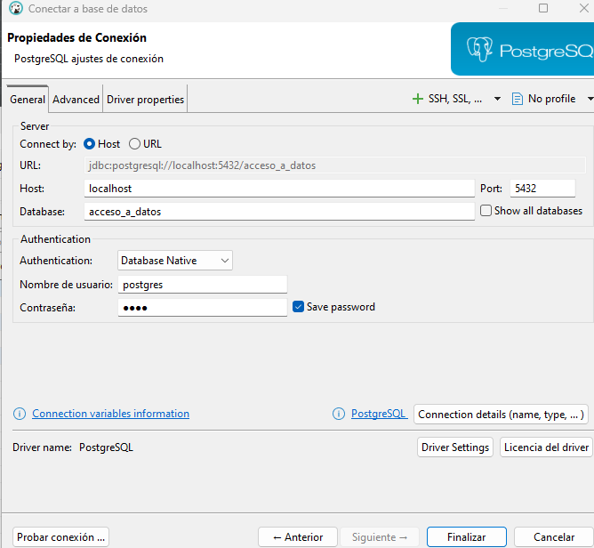
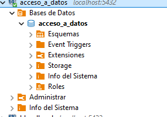
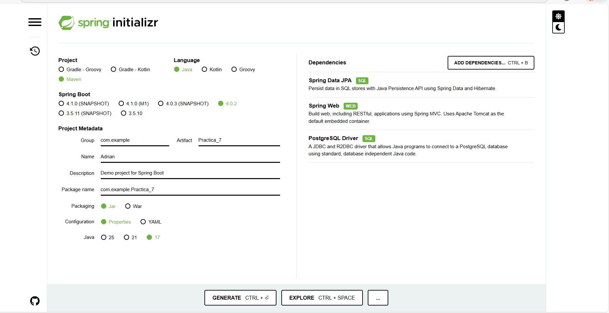
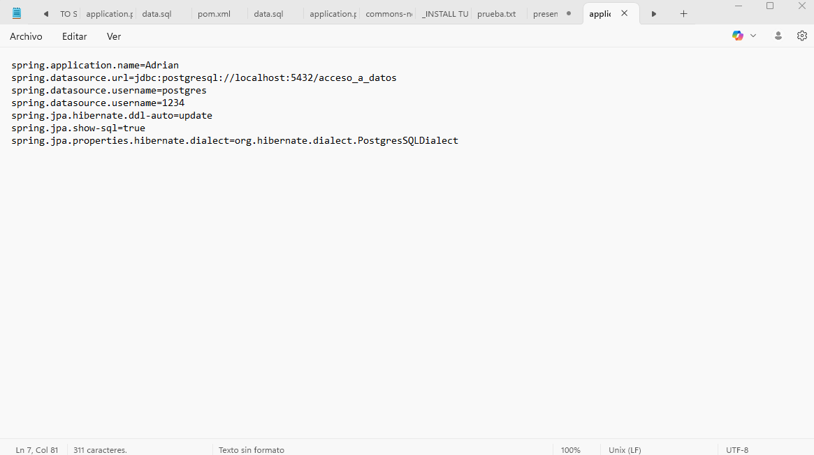
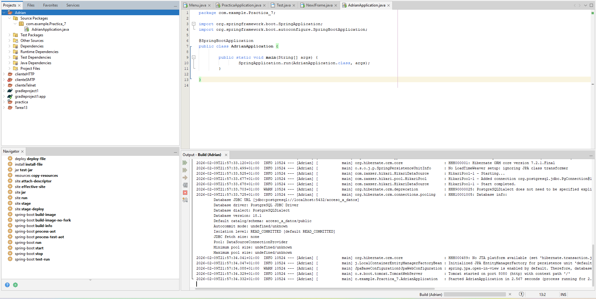

 Ejercicio guiado + practica

# Ejercicio guiado

## Parte 1: PostgreSQl (base de datos)
Acceda a la siguiente página: https://www.postgresql.org/download/ y descargue PostgreSQL. 
Una vez descargado podemos probar si funciona ejecutando el siguiente comando en una 
terminal (git bash): 

A continuación vamos a crear un usuario y su contraseña para acceder a nuestra base de datos, 
utilizaremos el siguiente comando:

Por último vamos a crear una base de datos con nombre acceso_a_datos utilizando el siguiente 
comando:

## Parte 2: DBeaver (gestor de base de datos)

Vamos a instalar el gestor de base de datos DBeaver, el cual es openSource y permite 
conectarnos a muchos tipos diferentes de bases de datos. Es un programa muy ligero y eficiente. 
Para instalar DBeaver deberemos acceder a la siguiente página: https://dbeaver.io/.  
A continuación podemos probar a conectar la base de datos previamente creada con DBeaver. 
Para ello debemos dirigirnos a la opción de añadir una conexión con una base de datos. Dentro 
del menú que aparece debemos indicar que nos queremos conectar a una base de datos de tipo 
PostgreSQL:

Tras esto debemos rellenar información acerca nuestra base de datos que previamente hemos 
configurado, sustituyendo los datos necesarios por los que esté utilizando en su proyecto:

Tras realizar esta configuración podemos observar que aparece nuestra base de datos conectada 
en DBeaver.
 En este punto ya podríamos realizar consultas sobre nuestra base de datos.

 ## Parte 3: Spring Boot (Framework Java) + Hibernate

 Como ya sabemos para inicializar un proyecto con Sprint Boot, nos dirigimos a la siguiente 
página: https://start.spring.io/ y aplicamos en este caso la siguiente configuración, sustituyendo 
los datos necesarios por los que esté utilizando en su proyecto: 
 

Puede observar que estamos instalando una dependencia diferente respecto a la práctica 
anterior: un driver para nuestra base de datos PostgreSQL. Además ahora podemos observar que 
la dependencia Spring Data JPA incluye Hibernate.

## Parte 4: Java + Maven (lenguaje + gestor de dependencias)

Rellene en el archivo application.properties con los siguientes campos, sustituyendo los datos 
necesarios por los que esté utilizando en su proyecto:

Para lanzar una aplicación Spring Boot deberá añadir la siguiente configuración, recuerde que 
este paso cambiará si usa Ant o Gradle para su proyecto:

# Ejercicio
