# Ejercicio 1: 
En la práctica de los temas 7 y 8 creamos dos clases persistentes con sus servicios 
correspondientes. Para realizar esta práctica deberá crear un controlador relacionado con la 
clase persistente que no contiene la clave externa con el objetivo de construir una API.

## Parte 1. Creación de la clase controller. (1 punto) 
Cree una clase controlador, para ello incluya las anotaciones correspondientes vistas en 
teoría. Deberá establecer ya la ruta base al recurso que ofrecerá este controlador y tener 
como atributo el servicio correspondiente.
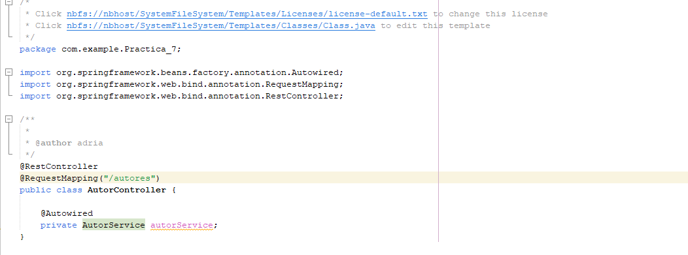

## Parte 2.1 Creación de un método POST. (1 punto)

Dentro de la clase controlador vamos a crear nuestro primer método de la API que nos 
permitirá insertar datos en la base de datos a través de peticiones HTTP. Para ello deberá 
crear un método que cumpla con lo siguiente: 
• Es un método de tipo POST. 
• La ruta a la que se hace petición de inserción es /nombreRecurso donde 
nombreRecurso es el nombre del recurso elegido en la cabecera del controlador (es 
decir, no se añade nada más a la ruta). 
• Recibe por parámetro el objeto JSON que se va a insertar (@RequestBody). 
• Insertará un objeto en la base de datos. 
• Devuelve el id del objeto insertado así como un código HTTP 201.

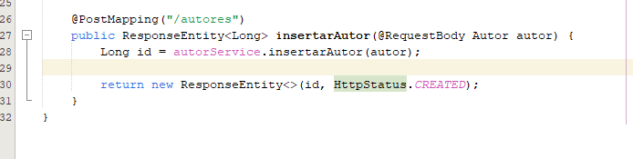

## Parte 2.2 Prueba del método POST. (1 punto)
A continuación deberá hacer uso de Postman para crear una petición HTTP que inserte 
un objeto en la base de datos. Antes de realizar esto asegúrese de borrar todo el 
contenido de la base de datos para una mayor claridad en las capturas y borre todo lo 
que se añadió en el método main del proyecto en la práctica anterior. 

## Parte 3.1 Creación de un método PUT. (1 punto)

Dentro de la clase controlador vamos a crear un método de la API que nos permitirá 
actualizar datos en la base de datos a través de peticiones HTTP. Para ello deberá crear 
un método que cumpla con lo siguiente: 
• Es un método de tipo PUT. 
• La ruta a la que se hace petición de inserción es /nombreRecurso/id donde 
nombreRecurso es el nombre del recurso elegido en la cabecera del controlador e id 
es un parámetro de la URL que indica el id del elemento que vamos a actualizar. 
• Recibe por parámetro el id del elemento que se va a actualizar (@PathVariable) y el 
atributo que se va a actualizar (@RequestParam). 
• Actualizará un objeto en la base de datos identificado por dicho ID y le pondrá un 
nuevo valor de atributo (dependerá del método del servicio). 
• Devuelve el código HTTP 200. 

## Parte 3.2 Prueba del método PUT. (1 punto)
A continuación deberá hacer uso de Postman para crear una petición HTTP que actualice 
un objeto de la base de datos. 

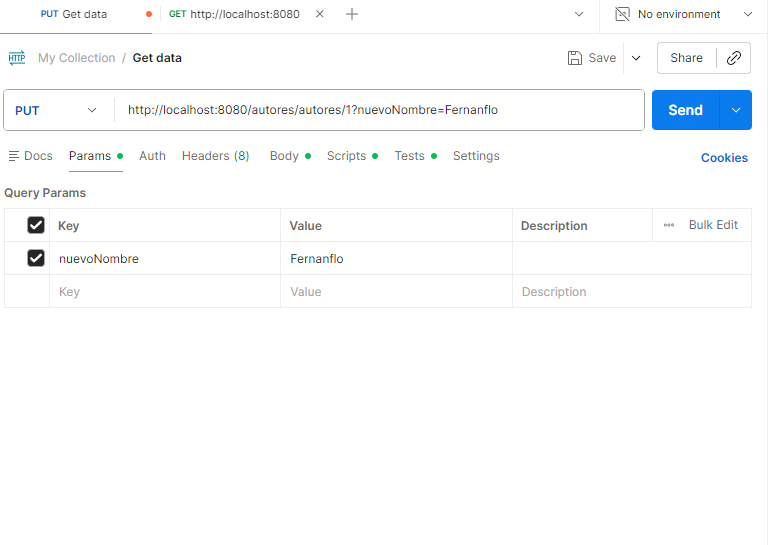
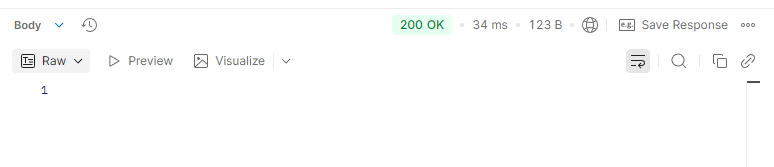
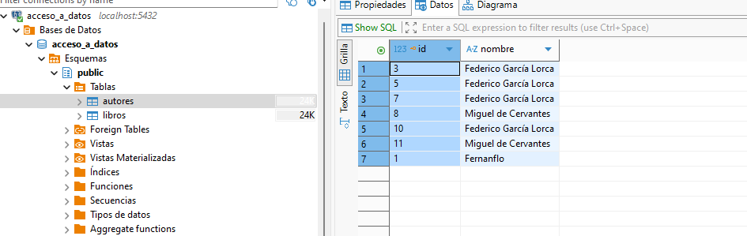

## Parte 4.1 Creación de un método GET por ID. (1 punto)
Dentro de la clase controlador vamos a crear un método de la API que nos permitirá 
obtener datos en la base de datos a través de peticiones HTTP. Para ello deberá crear un 
método que cumpla con lo siguiente: 
• Es un método de tipo GET. 
• La ruta a la que se hace petición de inserción es /nombreRecurso/id donde 
nombreRecurso es el nombre del recurso elegido en la cabecera del controlador e id 
en un parámetro de la URL que indica el id del elemento que vamos a obtener. 
• Recibe por parámetro el id del elemento que se va a obtener (@PathVariable). 
• Obtendrá un objeto en la base de datos identificado por dicho ID. 
• Devuelve: 
• Si existe un elemento con dicho ID: El objeto y el código HTTP 200. 
• Si no existe: El código HTTP 404.

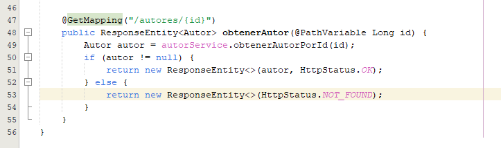

## Parte 4.2 Prueba del método GET por ID. (1 punto) 
A continuación deberá hacer uso de Postman para crear una petición HTTP que obtenga 
un objeto de la base de datos.

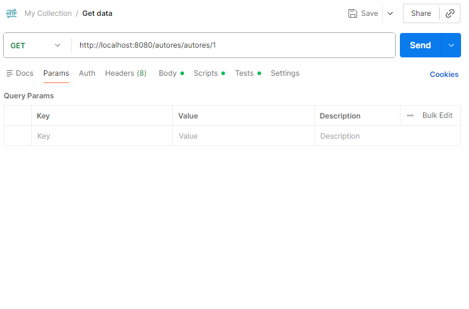
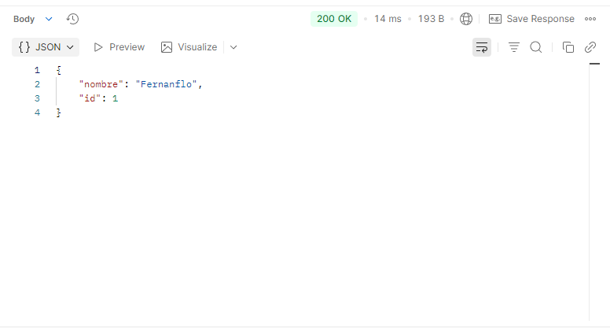
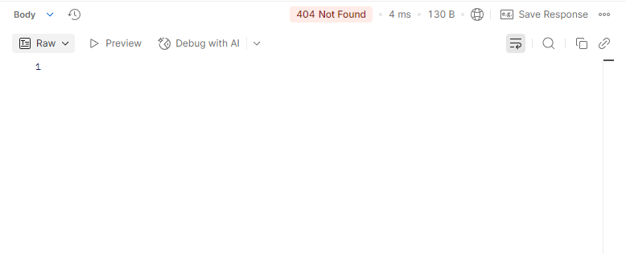

## Parte 5.1 Creación de un método GET genérico. (1 punto) 
Dentro de la clase controlador vamos a crear un método de la API que nos permitirá 
obtener todos los datos de la base de datos a través de peticiones HTTP. Para ello 
deberá crear un método que cumpla con lo siguiente: 
• Es un método de tipo GET. 
• La ruta a la que se hace petición de inserción es /nombreRecurso/ donde 
nombreRecurso es el nombre del recurso elegido en la cabecera del controlador y “/“ 
es una convención utilizada para indicar todos los elementos en una API. 
• No recibe ningún parámetro. 
• Obtendrá todos los datos de la base de datos (deberá crear un método en el servicio 
para ello. 
• Devuelve: 
• Si hay datos: Una lista de objetos y el código HTTP 200. 
• Si no existen datos: El código HTTP 204.

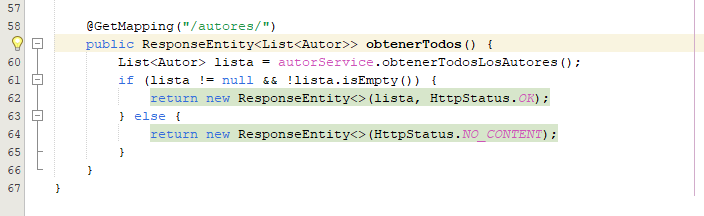
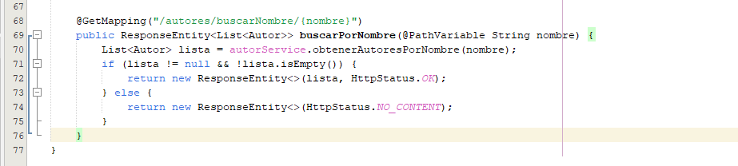

## Parte 5.2 Prueba del método GET genérico. (1 punto) 
A continuación deberá hacer uso de Postman para crear una petición HTTP que obtenga 
todos los datos de la base de datos. 

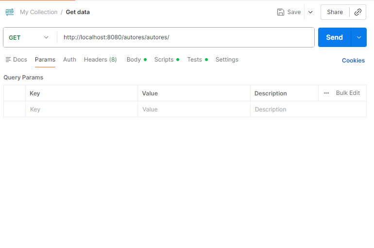
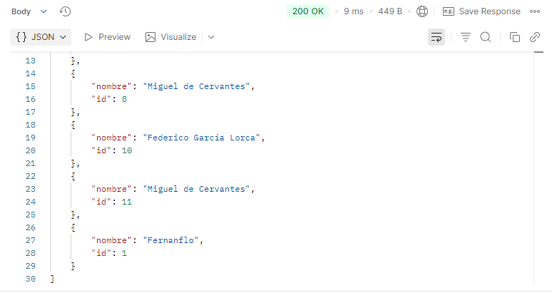

## Parte 6.1 Creación de un método GET por otro atributo. (1 punto)

Dentro de la clase controlador vamos a crear un método de la API que nos permitirá 
obtener todos los datos de la base de datos que cumplan una determinada condición a 
través de peticiones HTTP. (Recuerde que ya creamos en nuestro servicio un método 
para ello, en mi caso era obtener películas con duración menor a X minutos). Para ello 
deberá crear un método que cumpla con lo siguiente: 
• Es un método de tipo GET. 
• La ruta a la que se hace petición de inserción es /nombreRecurso/condición/dato 
donde nombreRecurso es el nombre del recurso elegido en la cabecera del 
controlador, condición en mi caso sería “duracionMenorA”, debéis adaptarlo a vuestro 
caso y dato es un parámetro de la URL que nos permitirá filtrar. 
• Recibe por parámetro “dato” (@PathVariable). 
• Obtendrá todos los datos de la base de datos que cumplan la condición. 
• Devuelve: 
• Si hay datos: Una lista de objetos y el código HTTP 200. 
• Si no existen datos: El código HTTP 204.
