# Ejercicio 2: 
En la práctica de los temas 7 y 8 creamos dos clases persistentes con sus servicios 
correspondientes. Para realizar esta práctica deberá crear un controlador relacionado con la 
clase persistente que contiene la clave externa con el objetivo de construir una API.
## 1. Método POST
Deberá crear un método para insertar elementos. - La ruta deberá ser: /recurso dónde “recurso" en mi ejemplo sería sesiones. - En el body de la petición no se incluirá la clave externa. - En un parámetro se mandará el id de la clave externa. - Si no se encuentra el elemento relacionado (película en mi caso) deberá devolver un 
mensaje de error descriptivo así como el código HTTP 404. - Si todo va bien, devuelve el ID y el código 201. 
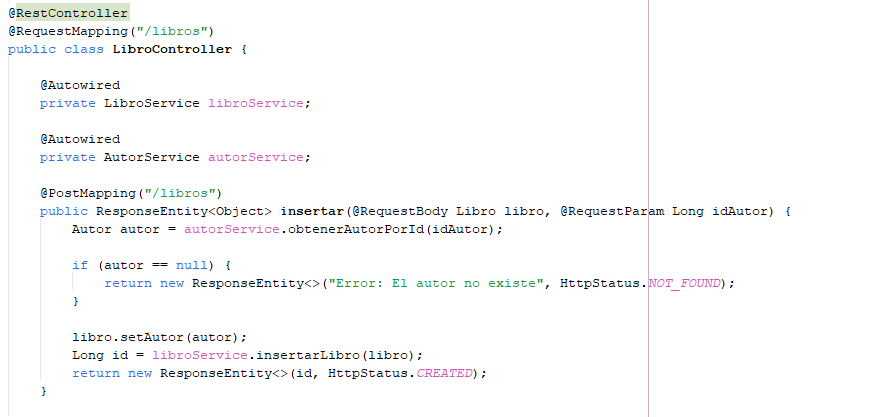

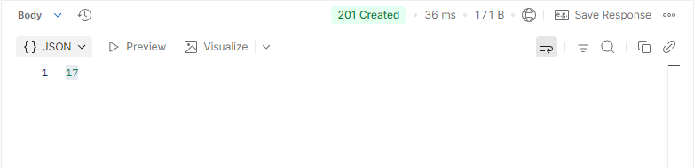
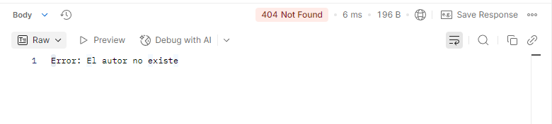
## 2. Método PUT atributo 
Deberá crear un método para actualizar un atributo de un objeto. En mi caso podría crear 
un método para actualizar la hora de una sesión y: - La ruta sería ser: /sesiones/{id}/hora. - En un parámetro se mandará el nuevo valor de atributo . - Si no se encuentra el elemento asociado al id se devolverá un mensaje de error 
descriptivo y el código HTTP 404. - Si todo va bien devuelve el código 200. 
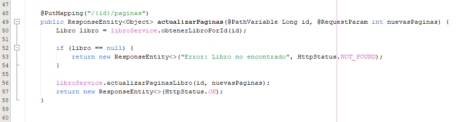
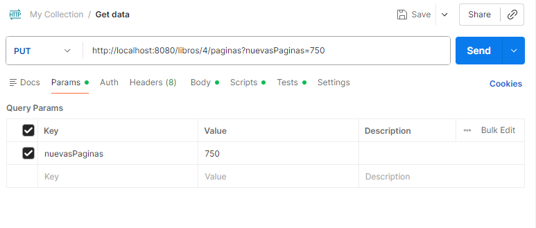
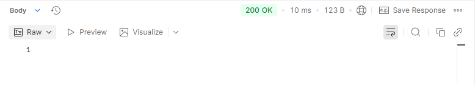
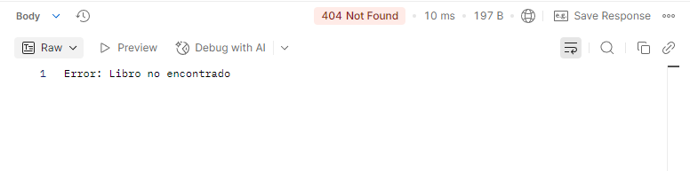
## 3. Método PUT clave externa
Deberá crear un método para actualizar la clave externa. En mi caso: - La ruta sería ser: /sesiones/{id}/pelicula/{idPelicula}. - Si no se encuentra el elemento asociado al id principal se devolverá un mensaje de 
error descriptivo y el código HTTP 404. - Si no se encuentra el elemento asociado al id de la clave externa se devolverá un 
mensaje de error descriptivo y el código HTTP 404. - Si todo va bien devuelve el código 200. 
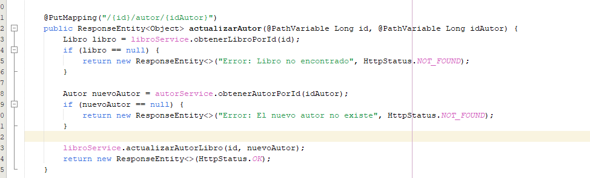
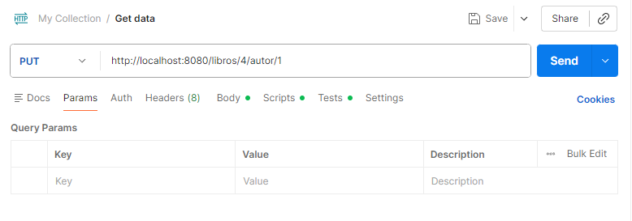
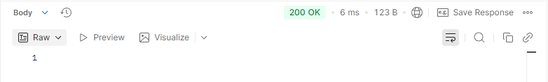
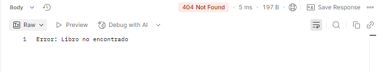
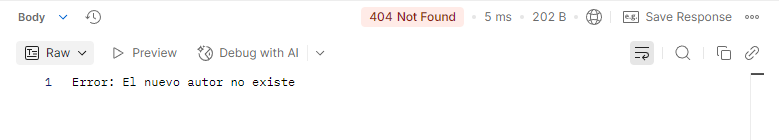
## 4. Método DELETE
Deberá crear un método para eliminar un elemento. En mi caso: - La ruta sería ser: /sesiones/{id}. - Si no se borra deberá devolver un código HTTP 404 y un texto descriptivo. - Si se borra devuelve el código 200.
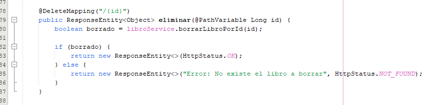

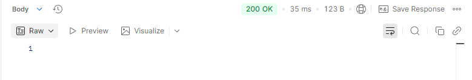
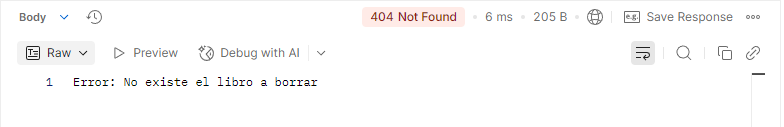
## 4. Método GET por id 
Deberá crear un método para obtener un elemento dado un id. - Si encuentra el elemento deberá devolver dicho elemento y el estado 200. - Si no lo encuentra debe devolver un texto descriptivo y el código 404.
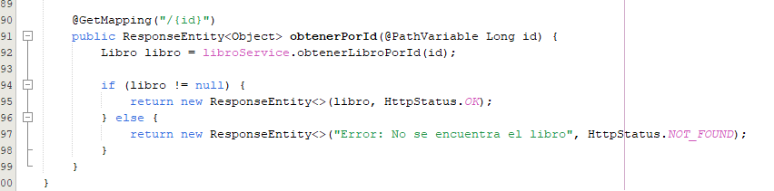
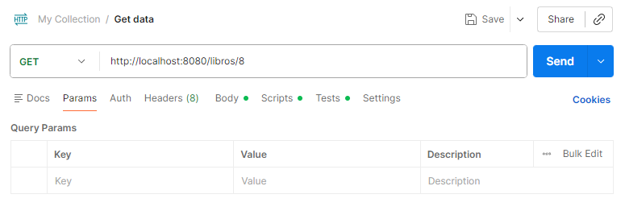
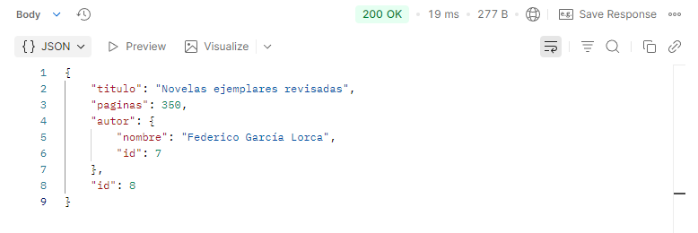
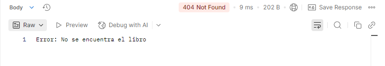
## 5. Método GET genérico
Deberá crear un método para obtener un elemento dado un id. - Si encuentra elementos deberá devolver dichos elementos y el estado 200. - Si no lo encuentra debe devolver un texto descriptivo y el código 404. 
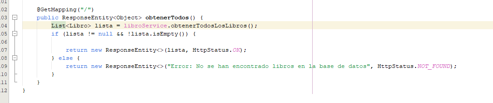
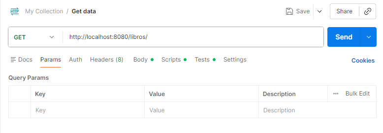
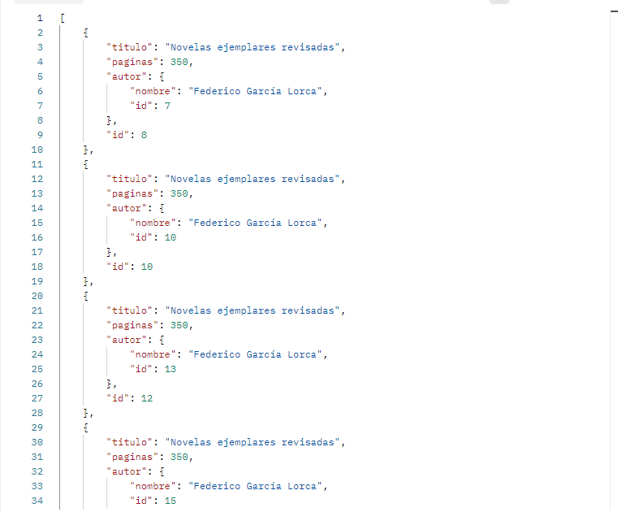
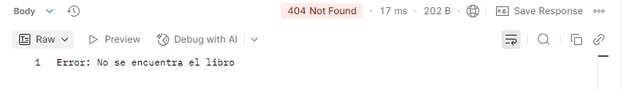
